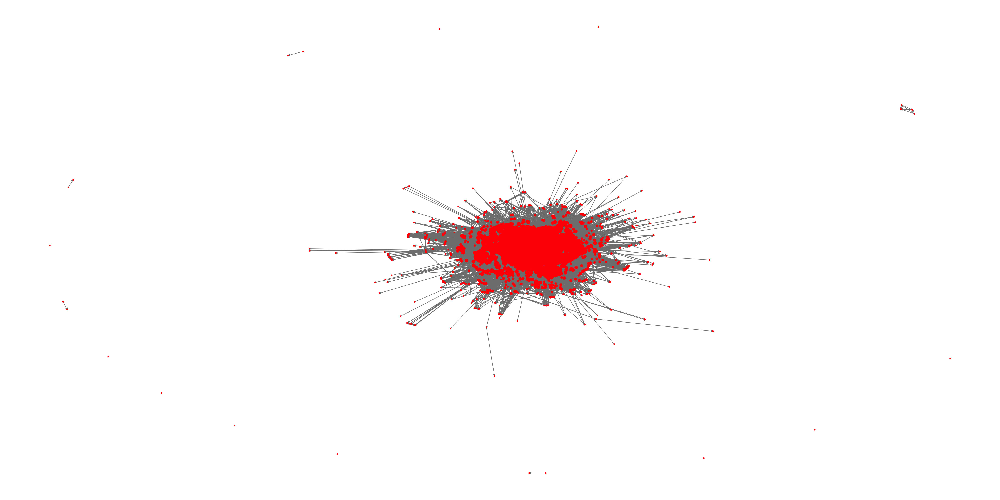
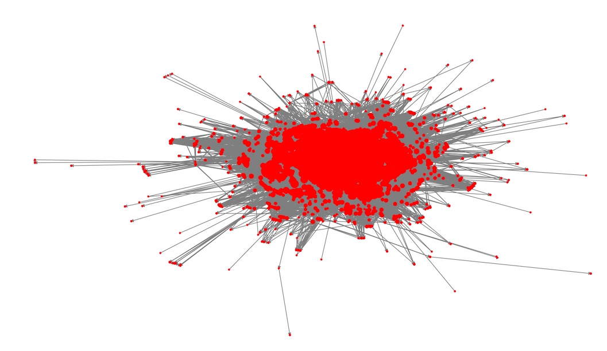

```{r setup,include=FALSE}

knitr::opts_chunk$set(echo = TRUE, warning = FALSE)

library(GGally)
library(ggraph)
library(ggthemes)
library(igraph)
library(MASS)
library(qgraph)
library(readr)
library(simpleboot)
library(statnet)
library(tidyverse)
library(twitterAnalytics)

```


QMSS- Networks Lab Report #3 (due Tuesday, April 24th)

Find a complete social network, preferably one with at least some attributes about the nodes with it.

# 1. Description

**Describe the social network(s) to me, in terms of how it was collected, what it represents and so forth. Also give me basic topography of the network: the nature of the ties; direction of ties; overall density; and if attributes are with the network, the distribution of the categories and variables of those attributes.**

For this assignment, I experimented with two different datasets. I started with the news dataset I used for my Master's thesis, consisting of 14,000 articles from 2017, all related to the theme of immigration raids in the United States. This was fine up until the point where I tried to calculate the Girvan-Newman communities, at which point the large size of the dataset jammed the algorithm. 

I hence chose to also work with the Twitter dataset I used in Assignment #2, which consists of tweets I scraped in October 2015 during a day of action against Blackstone Corporation by the Spanish La Plataforma de Afectados por la Hipoteca group. The dataset consists of 8310 tweets and retweets. I use the dataset to produce a directed retweet network, where someone retweeting another user establishes an edge directed towards that user.

Starting with the large text dataset, I wanted to explore how events can be identified by forming edges between different articles. This plays into my Master's thesis, where I limited edges to news that had been published during the same day, forming an edge between them if they mentioned the same locations. Each mention of a location increased the weight of the edge and each new locations formed a new edge. The density of this network is 0.1792932.

```{r network_news}

edges_weighted <- readRDS("sn_edges_weighted.rds")

g_news <- graph_from_edgelist(as.matrix(edges_weighted[,1:2]), directed = FALSE)
E(g_news)$weight <- as.integer(edges_weighted$n)
graph_density_news <- edge_density(g_news, loops = FALSE)

# Commenting to avoid slow operations. Images display the outcome.
#adj_news <- get.adjacency(g_news, attr = 'weight')
#net_news <- network(adj_news, directed = TRUE)

#ggnet2(net_news, size = "indegree", arrow.size = 2, color = "red", label = FALSE, #label.size = 0.5, legend.position = "none")

```

The network was so large, that producing a graph visualization took a very long time. Because of this, I do not evaluate the chunk of code above and instead use an image of the graph (top) as well as a zoomed in version (bottom):





The Twitter dataset is much less dense, with a density as low as 0.002933962. The implementation of the fruchterman-rheingold layout algorithm in ggnet makes both networks form similar patterns, but the text data is clearly much more concentrated, with no significant clusters outside of the enormous central cluster of clusters.

```{r network_tweets, message=FALSE, warning=FALSE}

blackstone_df <- openxlsx::read.xlsx("blackstone_df.xlsx")

BlackstoneEdges <- getRetweetEdges(blackstone_df, rt_limit = 0)
BlackstoneEdgesFlipped <- as.data.frame(BlackstoneEdges)[c("V2", "V1")]

# Getting edge weights
BlackstoneEdgesWeights <- BlackstoneEdgesFlipped %>%
  as.data.frame() %>%
  group_by(V2) %>%
  count(V1)

el <- as.matrix(BlackstoneEdgesWeights)
g <- graph.edgelist(el[,1:2], directed = TRUE)
E(g)$weight <- as.integer(el[,3])
graph_density <- edge_density(g, loops = FALSE)

adj <- get.adjacency(g, attr = 'weight')
net <- network(adj, directed = TRUE)

ggnet2(net, size = "indegree", arrow.size = 2, color = "red", label = TRUE, label.size = 0.5, legend.position = "none")

```

# 2. Girvan-Newman 

**Run the Girvan-Newman community detection algorithm. Then run the random walk community detection algorithm.**

I run the Girvan-Newman algorithm only once, but the random walk algorith in a loop that extracts some facts about the type of groups produced with different amounts of steps. In the next section I formalise this loop as a function.

```{r tweets_community,message=FALSE,warning=FALSE}

ebc_blackstone <- cluster_edge_betweenness(g, directed = TRUE)
blackstone_walk_groups <- data.frame(cbind(vector("list", length = 20), 
                                           vector("list", length = 20)))
colnames(blackstone_walk_groups) <- c("Walks", "Groups")

for(i in 1:length(blackstone_walk_groups$Walks)) {
  blackstone_walk_groups$Walks[[i]] <- i 
  wg <- cluster_walktrap(g, steps = i)
  freq <- count((as.data.frame(wg$membership)), wg$membership)
  blackstone_walk_groups$Groups[[i]] <- length(wg)
  blackstone_walk_groups$Average_Size[[i]] <- mean(freq$n)
}

blackstone_walk_groups$Walks <- unlist(blackstone_walk_groups$Walks)
blackstone_walk_groups$Groups <- unlist(blackstone_walk_groups$Groups)

```

# 3. Groups

**Tell me how many groups each algorithm finds. Analyze how similar the two partitioning algorithms are in terms of putting nodes into groups with each other.**

I started by calculating walktrap groups for different amounts of walks, ranging between one and twenty. The point graph show how many members there are in each group and the size of the point the average amount of members in each group. I chose to analyse the walk with the smallest amount of groups and largest groups further, as a contrast to the Girvan-Newman community detection algorithm. This version "took" five steps. Looking further down, we find that there are two large groups for the five step version, one with 290 and the other with 550 members, trailed by several groups with between 10 and 20 members.

Moving on to the Girvan-Newman community detection algorithm as implemented in igraph, we note a very different type of community structure. The algorithm detects only one very large group, surrounded by a multitude of single node groups (and one two node group).

I additionally wrote a function, that outputs ggplots that visualise the amount of steps in a random walk, the amount of groups and average group size for a given graph. Running the function on one to four steps for the massive text based news graph, we note a tendency for the amount of groups to fall after the first step, but due to the size of the graph I did not want to run it with as wide of a range of steps as he twitter graph. Hence, it will remain unknown in this context, whether there would be similar spikes and fluctuations in the amount of groups as the amount of steps are increased.

```{r walk_group_function}

walk_groups_graph <- function(graph_input, steps) {
  
  df <- data.frame(cbind(vector("list", length = steps), 
                         vector("list", length = steps)))
  colnames(df) <- c("Walks", "Groups")

  for(i in 1:steps) {
    df$Walks[[i]] <- i 
    wg <- cluster_walktrap(graph_input, steps = i)
    freq <- count((as.data.frame(wg$membership)), wg$membership)
    df$Groups[[i]] <- length(wg)
    df$Average_Size[[i]] <- mean(freq$n)
  }
  
  df$Walks <- unlist(df$Walks)
  df$Groups <- unlist(df$Groups)
  
  p <- ggplot(df, aes(x = Walks, y = Groups, size = Average_Size)) +
    geom_point() +
    theme_few()

  return(p)
}

walk_groups_graph(g_news, 5)
walk_groups_graph(g, 20)

```

```{r}

#Edge betweenness centrality
length(unique(ebc_blackstone$membership))

ebc_freq <- count((as.data.frame(ebc_blackstone$membership)), ebc_blackstone$membership)

colnames(ebc_freq) <- c("Membership", "Freq")
ebc_freq <- arrange(ebc_freq, desc(Freq))

# Walktrap 
blackstone_walktrap <- cluster_walktrap(g, steps = 5)
length(unique(blackstone_walktrap$membership))

wt_freq <- count((as.data.frame(blackstone_walktrap$membership)), blackstone_walktrap$membership)

colnames(wt_freq) <- c("Membership", "Freq")
wt_freq <- arrange(wt_freq, desc(Freq))

head(ebc_freq, 10)
head(wt_freq, 10)

```

# 4. Visualize

**Visualize the network (either in R or Gephi), coloring the nodes by either Girvan-Newman grouping or the random walk grouping.**

```{r}

# Colors
cool <- rainbow(50, start=rgb2hsv(col2rgb('cyan'))[1], end=rgb2hsv(col2rgb('blue'))[1])
warm <- rainbow(50, start=rgb2hsv(col2rgb('red'))[1], end=rgb2hsv(col2rgb('yellow'))[1])
cols <- c(rev(cool), rev(warm))
mypalette <- colorRampPalette(cols)(255)

# Memberships for walktrap
walk_c5_blackstone <- cluster_walktrap(g, steps = 5)
blackstone_memberships <- data.frame(cbind(walk_c5_blackstone$names, 
                                           walk_c5_blackstone$membership))
colnames(blackstone_memberships) <- c("screen_name","membership")

V(g)$membership <- blackstone_memberships$membership[match(V(g)$name, as.character(blackstone_memberships$screen_name))]

net %v% "membership" = as.character(V(g)$membership)

ebc_memberships <- data.frame(cbind(ebc_blackstone$names, 
                              ebc_blackstone$membership))
colnames(ebc_memberships) <- c("screen_name","membership")

V(g)$membership_ebc <- ebc_memberships$membership[match(V(g)$name, as.character(ebc_memberships$screen_name))]

net %v% "membership_ebc" = as.character(V(g)$membership_ebc)

ggnet2(net, size = "indegree", arrow.size = 2, color = "membership", palette = mypalette, label = TRUE, label.size = 0.5, legend.position = "none")

ggnet2(net, size = "indegree", arrow.size = 2, color = "membership_ebc", palette = mypalette, label = TRUE, label.size = 0.5, legend.position = "none")

```

# 5. Conclusions

Tell me anything else about whether the partitioning makes sense, based on attributes or who the nodes are, and so on.

Looking at the visualizations from the previous sections, we see that the walktrap community detection algorithm seems to be able to detect densely connected communities, as long as one is mindful of the amount of steps used. With five steps, the Twitter data is grouped into several visually intuitive soubgroups, where a broker between two groups is placed in one of the two groups and notes on either side of the relationship associated with each other. However, towards the center of the graph, several subgroups seem to go undetected, indicating that some amount of groups between the extremelly high amount we get with four steps or less and the fairly low amount we get with five steps, would make the most sense. Looking at the plot with walks, groups and group sizes, an optimal amount of walks might be around 15? The algorithm moves in a line in and out of the graph (because these are the only connections it can follow in a few steps) and finds the communities in a way that graphically produces intuitive clusters of similar colors in the edges but also (less intuitively) draws a line of sorts from these edges towards the middl (there are yellow nodes in the center adjacent to the yellow peripheral communities, green ones to the green nodes etc). 

Moving on to the Girvan-Newman based graph, it is harder to detect any sort of sensible structure, except with the nodes in the middle of the graph which all share the same color. This is probably due to the sparse nature of the connections in the graph; there are no dense subgroups. Instead, subgroups are supposed to be the nodes that are connected to the rest of the network by the same broker but not connected to each other. The nodes in the center are densely connected, while the peripheral nodes aren't really connected except to the broker that connects them to the rest of the network. The Girvan-Newman commuunity detection algorithm operates by progressively removing edges and finding the shortest paths using the remaining edges. The structure of the retweet network seems to be such, that the edge-betweenness hierarchy between the majority of the edges is very hard to determine and groups are difficult to detect. 

