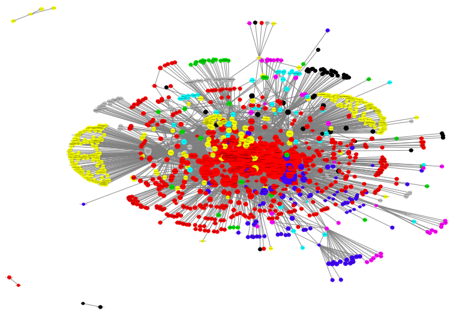

# Social Network Analysis
## Mikael Brunila

These are homework assignments for the Social Networks class by professor Greg Eirich at the Columbia University QMSS program in the spring of 2018. The code is packed in .Rmd files. To see the final output, clone the repo and open the html files in each hw directory in your browser. 